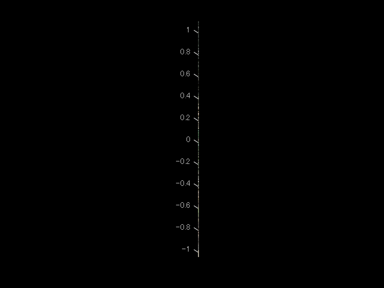
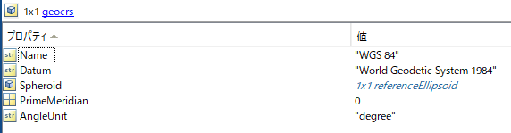
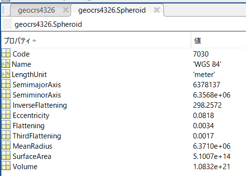
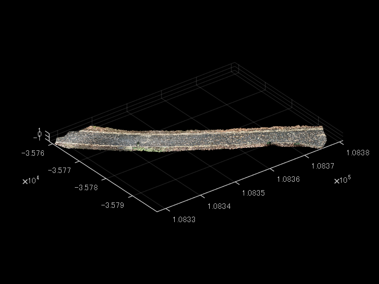
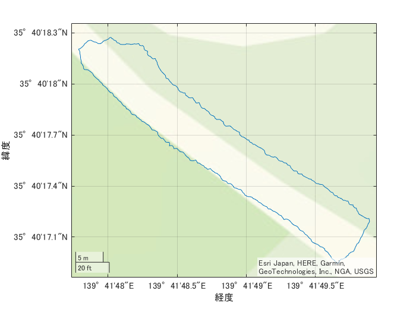

# iPhone LiDARで取得した3次元点群の境界を書き出してみよう

この記事は、MATLABアドベントカレンダー22日目の記事として書かれています。

[https://qiita.com/advent-calendar/2022/matlab](https://qiita.com/advent-calendar/2022/matlab)

この記事の前編として以下の記事も投稿しています。ぜひご覧ください。

[https://kentapt.hatenablog.com/entry/matlabQiita](https://kentapt.hatenablog.com/entry/matlabQiita)

  

この記事では、iPhone LiDARで取得した3次元点群をMATLABにて読み込み、さらに、その領域の境界のデータをKMLファイルとして出力する方法を紹介します。言語はMATLABを使用します。

3次元点群を取得するためのアプリは3D Scanner Appを用いました。

詳しい使い方は、以下の記事がわかりやすかったです。

[https://note.com/iwamah1/n/n9b1c39ed7e70](https://note.com/iwamah1/n/n9b1c39ed7e70)

また、以下の記事でもこちらのアプリの使い方を紹介しています。

[https://note.locusblue.com/n/n705c705469e8](https://note.locusblue.com/n/n705c705469e8)

  

ここでは、すでにiPad LiDARにて計測し、PCに転送した状態から始めます。

  

なお、ここで用いたコードや、点群ファイルは以下のページにアップロードされています。

[https://github.com/KentaItakura/Plot-iPhone-LiDAR-data-in-3D-basemap-using-MATLAB](https://github.com/KentaItakura/Plot-iPhone-LiDAR-data-in-3D-basemap-using-MATLAB)

# 点群ファイルの読み込み

LiDAR toolboxの機能を用いて、点群データの読み込みを行います。以下のように、`lasFileReader`や`readPointCloud`関数を用いて、簡単に点群ファイルを読み込むことができます。まずは、GPS情報を有した点群（LAS）ファイルをそのまま読み込み、表示してみます。なお、上のgithubのページでは、ファイルサイズを小さくするため、サンプルファイルのファイル形式をLAZ形式に圧縮してアップロードしています。（3D Scanner Appでは、LAS形式で点群がエキスポートされます。）MATLABに読み込む方法などは変わりません。

```matlab:Code
clear;clc;close all
% las/lazファイルを読み込むためのlasFileReader objectを作成する
lasReader = lasFileReader('sample.laz');
% las/lazファイルの、xyzおよび色情報を読み込み
ptCloud = readPointCloud(lasReader);
% 可視化
figure;pcshow(ptCloud)
```



しかし、単に読み込むだけでは、このように、うまく表示できません。2022年12月現在、3D Scanner Appから、Geo-referenceされた（位置情報を持っている）LASファイルをエキスポートすると、その座標は経度・緯度の値を持っています。経度緯度の値は、小数点以下の数が非常に多く、単にビューワーに読み込むだけではうまく行かない場合も多いです。

# 座標系の変換
## geocrsオブジェクトの作成

MATLABの`pcshow`関数で点群を閲覧するために、経度緯度のxy座標を投影座標に変換します。

```matlab:Code
% geojcrsオブジェクトを作成する
geocrs4326 = geocrs(4326);
```

ここで、作成した、`geocrs`オブジェクトの中身について確認します。

```matlab:Code
% 確認のため、geocrsを表示
disp(geocrs4326)
```

```text:Output
  geocrs のプロパティ:

             Name: "WGS 84"
            Datum: "World Geodetic System 1984"
         Spheroid: [1x1 referenceEllipsoid]
    PrimeMeridian: 0
        AngleUnit: "degree"
```

測地系（Datum）の情報や、Spheroid（楕円体）の情報格納されています。

`PrimeMeridian`は、本初子午線のことで、ここの数字は、緯度の基準が旧グリニッジ天文台からどれくらいの差分があるかを示しています。今回は0なので特に気にする必要はありません。



また、`Spheroid`をクリックすると、その中身を確認することができます。



一部のみを紹介します。

   -  `Code`: 割り当てられている識別コード EPSG:7030 
   -  `SemimajorAxis`: 赤道半径 6,378,137 m 
   -  `InverseFlattening`: 扁平率の逆数 298.257223563 

扁平率とは、（今回は）地球を表す楕円体が、完全な球と比べた時にどれくらい、扁平であるか（つぶれているか）を示します。全くつぶれていない（＝球と同じ）場合は、0となり、つぶれているほど、1に近づきます。

楕円体の長半径をa、短半径をbとすると、扁平率は、


で表すことができます。

実際にその逆数を計算してみると、

```matlab:Code
f = 1-geocrs4326.Spheroid.SemiminorAxis/geocrs4326.Spheroid.SemimajorAxis;
1/f
```

```text:Output
ans = 298.2572
```

となり、`InverseFlattening`の値と一致することが確認できます。

また、`geocrs`オブジェクトを用いて、そのWKTを簡単に作成することもできます。

WKT（Well-Known Text）は、ジオメトリの情報をテキスト形式で記述するものです。

```matlab:Code
str = wktstring(geocrs4326)
```

```text:Output
str = "GEOGCRS["WGS 84",DATUM["World Geodetic System 1984",ELLIPSOID["WGS 84",6378137,298.257223563,LENGTHUNIT["metre",1]]],PRIMEM["Greenwich",0,ANGLEUNIT["degree",0.0174532925199433]],CS[ellipsoidal,2],AXIS["geodetic latitude (Lat)",north,ORDER[1],ANGLEUNIT["degree",0.0174532925199433]],AXIS["geodetic longitude (Lon)",east,ORDER[2],ANGLEUNIT["degree",0.0174532925199433]],USAGE[SCOPE["Horizontal component of 3D system."],AREA["World."],BBOX[-90,-180,90,180]],ID["EPSG",4326]]"
```

ここでも、さきほどの、`geocrs`オブジェクトのような情報が確認できます。

## projfwd関数を用いた、座標の変換

それでは、経度緯度の座標を投影座標に変換したいと思います。

このサンプルデータは、東京都で取得されたため、EPSGコードは6676を利用します。

変換自体は、`projfwd`関数を用いて簡単に行うことができます。

```matlab:Code
lon = ptCloud.Location(:,1);
lat = ptCloud.Location(:,2);
proj = projcrs(6676);
[x,y] = projfwd(proj,lat,lon);
```

## pcshow関数を用いた、点群の閲覧

```matlab:Code
pointCloudProj = pointCloud([x,y,ptCloud.Location(:,3)],"Color",ptCloud.Color);
figure;pcshow(pointCloudProj)
```



# 3次元マップでの点群の可視化

次に、投影したxy座標をもとに、iPhone LiDARで取得した点群を、3次元のマップ上で可視化してみます。

このセクションの内容は、以前の投稿と同様です。詳細は以下の記事をご覧ください。

```matlab:Code
% 25点のうち1点のみを表示する。重くなってしまうため。
mskip = 1:50:length(lat);
% 3Dで可視化するための図を用意する
uif = uifigure;
g = geoglobe(uif);
% プロット
geoplot3(g,lat,lon,ptCloud.Location(:,3)-mean(ptCloud.Location(:,3)),'r','MarkerSize',2,'Marker','o','HeightReference','terrain','LineStyle','none','MarkerIndices',mskip)
```

# 境界の表示の書き込み

さきほどは、点群ファイル全体を3Dのマップ上に表示させました。次に、この点群ファイルの境界を計算し、その境界のみを2Dの地図上に可視化してみようと思います。

境界の計算は、`boundary`関数で簡単に行うことができます。

ここで、計算を軽くするために、さきほど用いた間引きの間隔を用いて、50点ごとに境界を計算する点を抽出します。

```matlab:Code
% 点の間引き
latSub = lat(mskip);
lonSub = lon(mskip);
% 境界の計算
k = boundary(latSub,lonSub);
% 可視化は、geoplot関数が便利です
figure;geoplot(latSub(k),lonSub(k))
% ベースマップの種類を指定できます
geobasemap streets
```



## kmlファイルへの書き込み

境界をkmlファイルとして書き込みを行います。

```matlab:Code
filename = 'myBoundary.kml';
kmlwriteline(filename, latSub(k), lonSub(k), 'Color','black','LineWidth', 3);
```

## Google Earth Proでの表示

Windows環境で、かつ、Google Earth Proをインストールしている場合、以下のコマンドで、さきほど保存したkmlファイルをGoogle Earth上で確認することができます。Google Earth Proを別途開くことなく、MATLABからコマンド1行で起動できるのは非常に便利ですね。

**Google Earth Pro（パソコン用）のダウンロードページ**

[https://www.google.com/intl/ja/earth/versions/\#download-pro](https://www.google.com/intl/ja/earth/versions/#download-pro)

```matlab:Code
winopen(filename)
```

以下の動画（GIF）では、`winopen(filename)`とコマンドウィンドウで入力しています。


# まとめ

   -  この記事では、iPhone LiDARで取得した点群をMATLABを用いて、地図上で可視化しました 
   -  投影座標系から経度・緯度への変換も簡単に行うことができました 
   -  3Dのベースマップ上で、点群を可視化することができました 
   -  表示する点数が多くなると、非常にビューワーが重くなるため、間引くことが必要です 

# 参考にしたページ（本文中に記載がないもの）

**とらりもん：測地系 (datum)**

\href{http://pen.envr.tsukuba.ac.jp/~torarimon/?%C2%AC%C3%CF%B7%CF%3A+datum}{http://pen.envr.tsukuba.ac.jp/\textasciitilde{}torarimon/?%C2%AC%C3%CF%B7%CF%3A+datum}

**Wikipedia: 扁平率**

[https://ja.wikipedia.org/wiki/%E6%89%81%E5%B9%B3%E7%8E%87](https://ja.wikipedia.org/wiki/%E6%89%81%E5%B9%B3%E7%8E%87)

**tohka383様：WKT にみる座標系について**

[https://qiita.com/tohka383/items/2b22dfdd442f987b6714](https://qiita.com/tohka383/items/2b22dfdd442f987b6714)

**MATLABドキュメンテーション：Transform Coordinates to a Different Projected CRS**

[https://jp.mathworks.com/help/map/transform-coordinates-to-different-pcrs.html](https://jp.mathworks.com/help/map/transform-coordinates-to-different-pcrs.html)

**MATLABドキュメンテーション：kmlwriteline**

[https://jp.mathworks.com/help/map/ref/kmlwriteline.html](https://jp.mathworks.com/help/map/ref/kmlwriteline.html)
